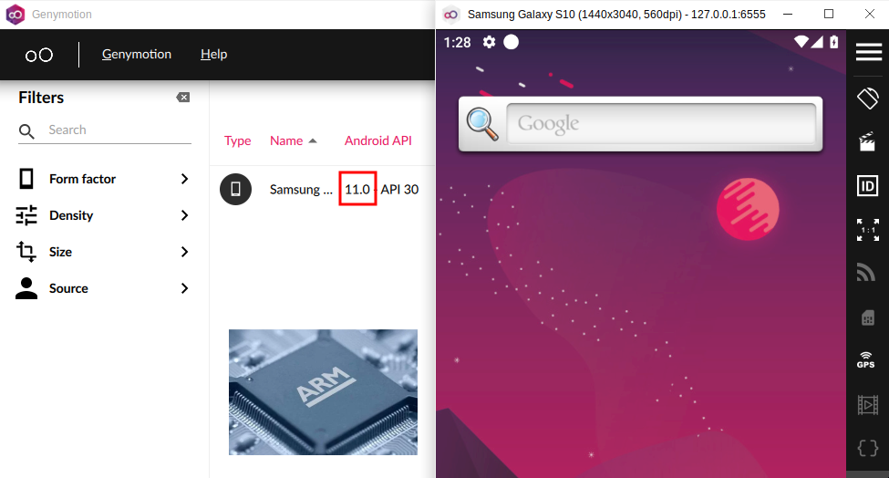
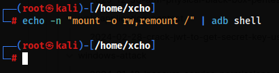
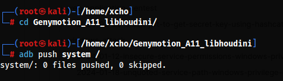
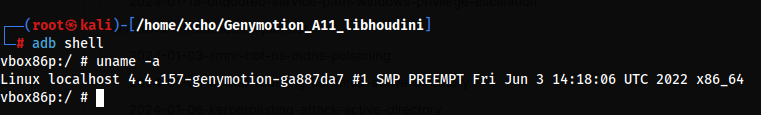
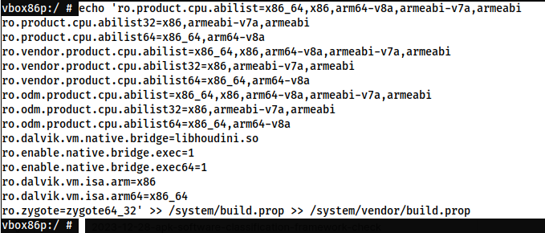
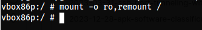

Sebagai seorang pekerja "kasar" di dunia IT yang sehari-harinya menggunakan laptop dengan arsitektur **x86**, tak jarang saya menemukan permasalahan tentang aplikasi Android yang hanya bisa dijalankan pada arsiterktur **ARM**. 

**Mengapa Android 11?** Karena Android versi 11-lah yang paling dekat dengan versi terbaru namun _"oprekable"_ dan masih bisa digunakan secara "gratis" di Genymotion.



Fungsi ARM Translation di sini yaitu untuk menjalankan arsitektur **ARM** meskipun arsitektur yang kita gunakan adalah **x86**.

# Download Library

Di sini saya sudah menyiapkan sebuah Repository publik. Repository ini bukan buatan saya, melainkan hasil Forking dari https://github.com/niizam/Genymotion_A11_libhoudini.

```
git clone https://github.com/xchopath/Genymotion_A11_libhoudini
```

# Pindahkan Library ke Android

Sebelum dilanjutkan, pastikan kita sudah berhasil mengkoneksikan Laptop dan Android menggunakan **ADB**.

Pada dasarnya direktori root (/) pada Android itu tidak dapat dimodifikasi untuk alasan keamanan, namun dengan Command di bawah ini, kita dapat mengatur izinnya agar direktori root (/) dapat ditulis (Writable).

```
echo -n "mount -o rw,remount /" | adb shell
```



Jika sudah, maka selanjutnya kita hanya perlu memindahkan folder `system` (libhoudini) yang kita download sebelumnya ke dalam sistem Android.

```
cd Genymotion_A11_libhoudini/
adb push system /
```



# Konfigurasi Android

Kita akan masuk ke tahap selanjutnya yaitu konfigurasi di dalam Android, sebelum itu kita perlu masuk ke dalam sistemnya terlebih dahulu melalui `shell`.

```
adb shell
```



Pada tahap ini kita akan menambahkan konfigurasi pada file `/system/build.prop` dan `/system/vendor/build.prop` untuk mengatur parameter arsitektur CPU dan pengeksekusian kode natif pada Android System.

```
echo 'ro.product.cpu.abilist=x86_64,x86,arm64-v8a,armeabi-v7a,armeabi
ro.product.cpu.abilist32=x86,armeabi-v7a,armeabi
ro.product.cpu.abilist64=x86_64,arm64-v8a
ro.vendor.product.cpu.abilist=x86_64,x86,arm64-v8a,armeabi-v7a,armeabi
ro.vendor.product.cpu.abilist32=x86,armeabi-v7a,armeabi
ro.vendor.product.cpu.abilist64=x86_64,arm64-v8a
ro.odm.product.cpu.abilist=x86_64,x86,arm64-v8a,armeabi-v7a,armeabi
ro.odm.product.cpu.abilist32=x86,armeabi-v7a,armeabi
ro.odm.product.cpu.abilist64=x86_64,arm64-v8a
ro.dalvik.vm.native.bridge=libhoudini.so
ro.enable.native.bridge.exec=1
ro.enable.native.bridge.exec64=1
ro.dalvik.vm.isa.arm=x86
ro.dalvik.vm.isa.arm64=x86_64
ro.zygote=zygote64_32' >> /system/build.prop >> /system/vendor/build.prop
```



Jika semuanya sudah dilakukan, maka langkah terakhirnya yaitu kita perlu mengatur atau mengembalikan izin direktori root (/) Android agar kembali seperti semula dan tidak dapat ditulis (read-only).

```
mount -o ro,remount /
```



Setelah itu langsung kita restart saja Android-nya.

```
reboot
```

Selesai! Dengan ini kita dapat menjalankan aplikasi Android yang bergantung pada arsitektur **ARM** meskipun arsitektur perangkat yang kita gunakan itu **x86**.
