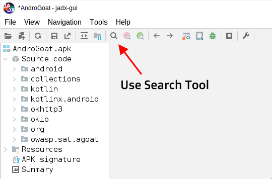
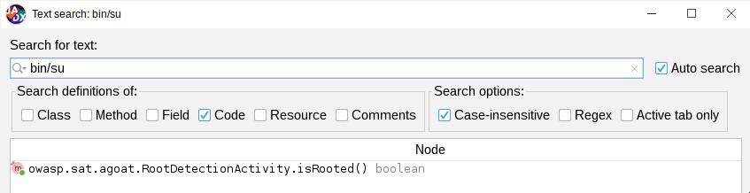
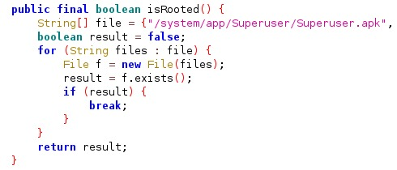
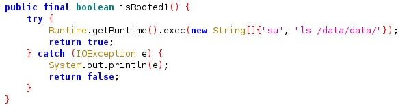
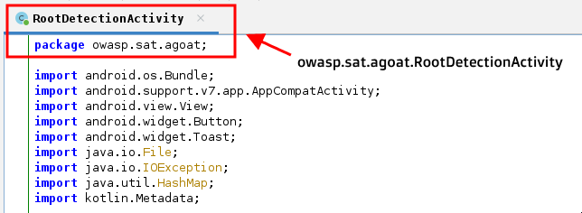
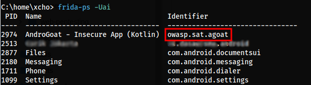
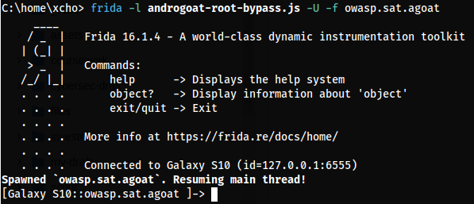

Sebelum kita mempraktekan hal-hal yang terkandung pada topik ini, alangkah baiknya kita mempersiapkan Tools di bawah ini terlebih dahulu:

- `jadx-gui` (instal pada PC/Laptop) - Untuk Reverse Engineering file APK
- `frida` (instal pada PC/Laptop) - Untuk menginjeksi script ke dalam Android untuk melakukan Hook
- `frida-server` (instal pada Android Device) - Untuk membuka koneksi Android agar Frida di PC dapat terkoneksi

Aplikasi yang akan menjadi fokus dalam studi kasus ini adalah `AndroGoat.apk`, kalian dapat download aplikasi tersebut pada [link ini](https://github.com/satishpatnayak/MyTest/blob/master/AndroGoat.apk). Jika semuanya sudah dipersiapkan, kita langsung masuk saja ke topik utama.

<h1 class="header-group">1. Reverse Engineering</h1>

Ketika melakukan Reverse Engineering (Basic) pada aplikasi Android, kita dapat menggunakan Tool `jadx-gui`. Dengan Tool ini akan mempermudah kita untuk melakukan eksplorasi terhadap aspek-aspek apa saja yang terkandung di dalam aplikasinya. Pastikan teman-teman sudah menginstal Tool `jadx-gui`. Jika sudah diinstal maka teman-teman hanya tinggal buka file APK-nya saja melalui `jadx-gui`

## 1. Find the APK Functions



Berikut ini adalah kueri umum yang dapat kita gunakan untuk menemukan fungsi **Root Detection**.

- `bin/su`
- `"su"`
- `/system/`
- `/data/data`
- `rootdetect`
- `isroot`



## 2. Analysis

Pada tahap ini, kita perlu membedah terkait fungsi-fungsi apa saja yang digunakan. Misalnya...

Ditemukan fungsi `isRooted()`



Ditemukan (lagi) fungsi `isRooted1()`



Dari hasil analisa ini kita sudah mengetahui bahwa terdapat 2 fungsi yang digunakan pada modul pendeteksi Root-nya.

Saat kedua fungsi ini mengembalikan (`return`) dengan nilai `false`, maka aplikasi akan menganggap bahwa Android Device yang kita gunakan itu masih dalam kondisi aman (belum di-root). Nah! Pada tahap ini nantinya `frida` akan bekerja untuk mengecoh aplikasi agar kedua fungsi tersebut selalu mengembalikan nilai `false`.

Jika disederhanakan, maka logikanya akan seperti ini:

```
isRooted()  => True  => Root Detected
isRooted1() => True  => Root Detected
isRooted()  => False => Not Rooted
isRooted1() => False => Not Rooted
```

### Package Location
Perlu dicatat juga bahwa Code yang kita analisa sebelumnya itu terdapat di dalam _Class_ `owasp.sat.agoat.RootDetectionActivity`, dengan ini nantinya aspek tersebut akan kita gunakan pada skrip Hook yang kita buat.



<h1 class="header-group">2. Hook</h1>

> **Hooking:**
> Memanipulasi aktivitas (di level Client-Side, secara Real-Time) pada sebuah aplikasi Android yang sedang berjalan.

Oh iya! Saat menjalankan aplikasi `AndroGoat.apk`, pada dasarnya aplikasi tersebut akan menampilkan pesan di bawah ini.


Namun setelah di-hook maka aplikasinya akan menampilkan pesan yang berbeda.


# Proof of Concept

Sebelum kita teruskan, pastikan kita sudah [menyiapkan Frida](javascript:alert('empty...')) supaya PC dan Android Device bisa saling terkoneksi.

## 1. Get App Identifier

Menggunakan Command di bawah ini, kita dapat melihat daftar semua proses yang sedang berjalan pada perangkat atau emulator Android yang terhubung melalui Frida. 

```sh
frida-ps -Uai
```



## 2. Hook Script

Sebagai contoh, di sini saya sudah menyiapkan sebuah skrip untuk melakukan Hook.

```javascript
Java.perform(
  function () {
    let CallJavaPackage = Java.use("owasp.sat.agoat.RootDetectionActivity");
    CallJavaPackage["isRooted"].implementation = function() { return false; };
    CallJavaPackage["isRooted1"].implementation = function() { return false; };
  }
);
```

Kembali ke fungsi "isRooted" dan "isRooted1", dengan skrip ini kita dapat memanipulasi perilaku aplikasi, yang di mana kedua fungsi tersebut akan di-"override" untuk selalu mengembalikan nilai `false`.

## 3. Hook

```sh
frida -l <hook-script> -U -f <app-identifier>
```



Jika sudah dan berhasil, maka hasilnya akan seperti ini.


