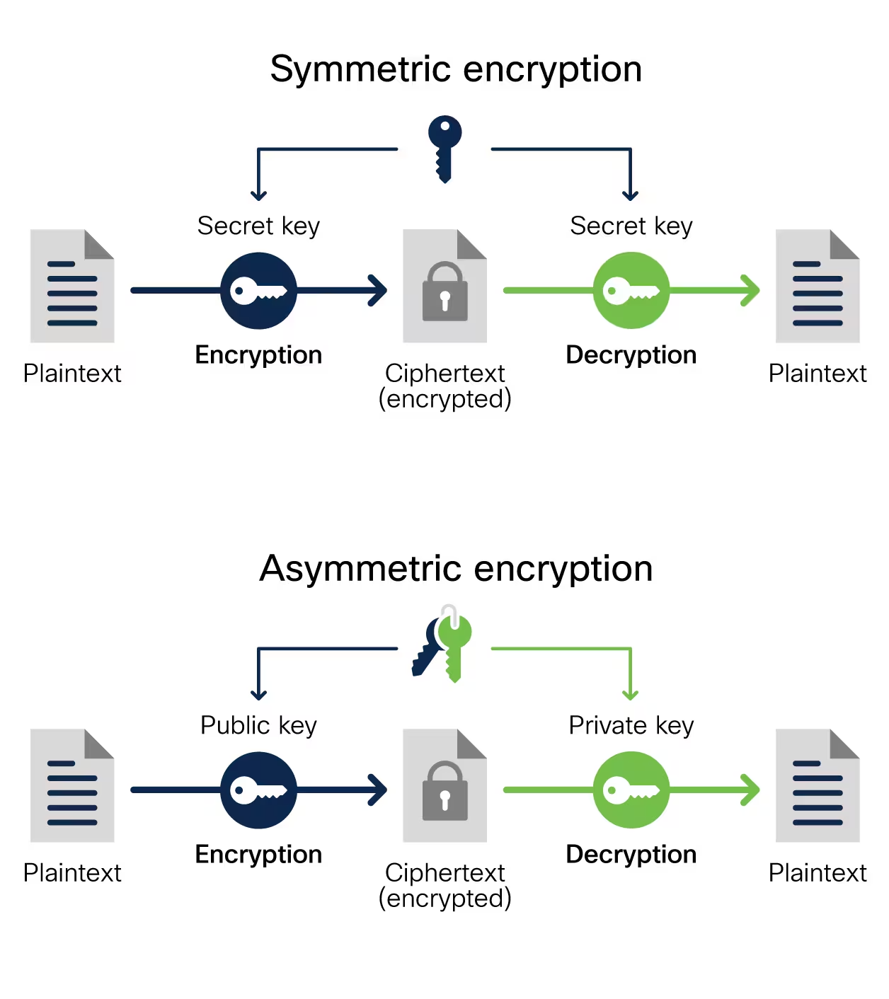
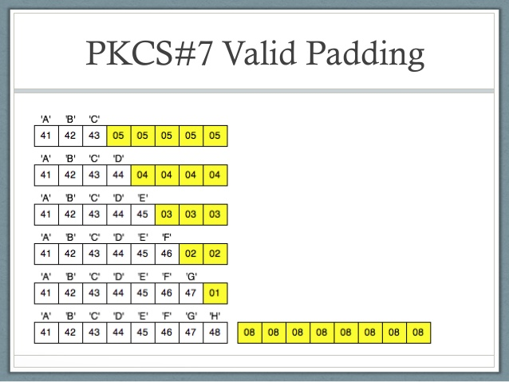

Sebelum artikel ini dimulai, saya ingin mengucapkan terima kasih sama seseorang, karena dia yang membuat saya "melek" dengan apa itu kriptografi, Halo mas [Bayu Fedra](https://github.com/bayufedra)!

Sebagai pemula di bidang kriptografi, saya akan mencoba menjelaskan tentang apa itu enkripsi AES dengan sesederhana mungkin, semoga artikel dapat dikonsumsi untuk orang yang belum pernah sama sekali berkenalan dengan AES ini.

**Apa itu AES?**

Advanced Encryption Standard (AES) adalah sebuah algoritma kriptografi yang digunakan untuk mengamankan data supaya terenkripsi dengan model kunci simetris (Symmetric) atau kunci tunggal. AES memiliki panjang kunci dengan berbagai macam tingkatan seperti 128-bit, 192-bit, atau 256-bit (semakin panjang kunci yang digunakan, maka semakin kuat keamanannya).

# Symmetric vs Asymmetric  
  
Karena AES adalah enkripsi yang memiliki model Symmetric, maka ada baiknya kita juga harus mengetahui apa itu Symmetric dan Asymmetric. Untuk mendeskripsikan tentang apa itu Symmetric Encryption atau enkripsi simetris, kita hanya perlu mengingat sebuah kata yaitu "kunci tunggal". Secara umum, enkripsi model simetris itu hanya menggunakan 1 kunci (yang sama) saat melakukan enkripsi maupun saat membuka enkripsinya (Decrypt). Berbeda dengan Asymmetric Encryption atau enkripsi asimetris, yang di mana saat mengenkripsi dan mendekripsi itu menggunakan kunci yang berbeda.  



Sebenarnya, AES bukanlah satu-satunya enkripsi yang menggunakan model simetris, karena masih ada enkripsi lainnya seperti DES, 3DES, Blowfish, RC4 dan masih banyak lagi.

# Mode

- CBC (Cipher Block Chaining)
- ECB (Electronic Codebook)

Pada dasarnya AES memiliki lebih dari 10 mode operasi yang bisa digunakan, seperti CBC, OCB, CFB, OFB, CTR, GCM, CCM, XTS, SIV, EAX, dan OCB. Namun, yang akan kita bahas di sini hanya 2, yaitu CBC dan ECB.

Di antara keduanya, mode ECB itu lebih lemah dari CBC, karena mode CBC memerlukan Initialization Vector (IV), sedangkan ECB tidak. IV di sini bisa kita umpamakan sebagai **kunci kedua**.

Contoh mode CBC: 
> Data + Key + IV = Encrypted

Contoh mode ECB: 
> Data + Key = Encrypted

Nah! Secara teori seperti itu, secara praktiknya kita dapat menggunakan kode di bawah ini.

AES mode CBC:
```html
<script src="https://cdnjs.cloudflare.com/ajax/libs/crypto-js/4.1.1/crypto-js.min.js"></script>
<script>
    var iv = CryptoJS.enc.Hex.parse('000102030405060708090a0b0c0d0e0f');

    function encryptText() {
        var key = CryptoJS.enc.Utf8.parse('KuNc1R4h4s14');
        var plaintext = document.getElementById("plaintext").value;
        var ciphertext = CryptoJS.AES.encrypt(plaintext, key, { iv: iv, mode: CryptoJS.mode.CBC, padding: CryptoJS.pad.Pkcs7 }); 
        document.getElementById("ciphertext").value = ciphertext.toString();
    }

    function decryptText() {
        var key = CryptoJS.enc.Utf8.parse('KuNc1R4h4s14');
        var ciphertext = document.getElementById("ciphertext").value;
        var decrypted = CryptoJS.AES.decrypt(ciphertext, key, {iv: iv, mode: CryptoJS.mode.CBC, padding: CryptoJS.pad.Pkcs7 });
        document.getElementById("decryptedtext").value = decrypted.toString(CryptoJS.enc.Utf8);
    }
</script>

<h2>AES.CBC</h2>
<label for="plaintext">Data:</label><br>
<textarea id="plaintext" rows="4" cols="50"></textarea><br><br>
<button onclick="encryptText()">Encrypt</button>
<button onclick="decryptText()">Decrypt</button><br><br>
<label for="ciphertext">Data Terenkripsi:</label><br>
<textarea id="ciphertext" rows="4" cols="50" readonly></textarea><br><br>
<label for="decryptedtext">Data Terdekripsi:</label><br>
<textarea id="decryptedtext" rows="4" cols="50" readonly></textarea><br><br>
```

AES Mode ECB:
```html
<script src="https://cdnjs.cloudflare.com/ajax/libs/crypto-js/4.1.1/crypto-js.min.js"></script>
<script>
    function encryptText() {
        var key = CryptoJS.enc.Utf8.parse('KuNc1R4h4s14');
        var plaintext = document.getElementById("plaintext").value;
        var ciphertext = CryptoJS.AES.encrypt(plaintext, key, { mode: CryptoJS.mode.ECB, padding: CryptoJS.pad.Pkcs7 });
        document.getElementById("ciphertext").value = ciphertext.toString();
    }

    function decryptText() {
        var key = CryptoJS.enc.Utf8.parse('KuNc1R4h4s14');
        var ciphertext = document.getElementById("ciphertext").value;
        var decrypted = CryptoJS.AES.decrypt(ciphertext, key, { mode: CryptoJS.mode.ECB, padding: CryptoJS.pad.Pkcs7 });
        document.getElementById("decryptedtext").value = decrypted.toString(CryptoJS.enc.Utf8);
    }
</script>

<h2>AES.ECB</h2>
<label for="plaintext">Data:</label><br>
<textarea id="plaintext" rows="4" cols="50"></textarea><br><br>
<button onclick="encryptText()">Encrypt</button>
<button onclick="decryptText()">Decrypt</button><br><br>
<label for="ciphertext">Data Terenkripsi:</label><br>
<textarea id="ciphertext" rows="4" cols="50" readonly></textarea><br><br>
<label for="decryptedtext">Data Terdekripsi:</label><br>
<textarea id="decryptedtext" rows="4" cols="50" readonly></textarea><br><br>
```

Kita bisa melihat kode **javascript** di keduanya. Pada `CryptoJS.mode.CBC` di situ terlihat memanggil variabel `iv`, namun pada `CryptoJS.mode.ECB` itu tidak.

# Initialization Vector (IV)  

Initialization Vector (IV) adalah nilai acak yang digunakan untuk memulai proses enkripsi, tapi biasanya IV hanya digunakan pada mode enkripsi yang mengharuskan vektor inisialisasi (seperti mode CBC). IV sendiri bisa kita anggap sebagai **kunci kedua** (hanya sebagai perumpamaan saja).
  
Namun, tidak semua mode menggunakan IV. Sebagai contoh, dalam mode ECB, IV tidak digunakan karena setiap blok dienkripsi secara independen, sehingga tidak ada ketergantungan antarblok yang memerlukan IV.

# Padding

Dalam kriptografi, Padding adalah proses menambahkan informasi tambahan ke pesan yang akan dienkripsi atau didekripsi sehingga ukuran pesan dibuat agar sama dengan panjang blok yang diharapkan dari sebuah algoritma enkripsi tertentu. Tujuan utama dari Padding adalah untuk mengisi "ruang kosong" pada blok terakhir jika pesan tidak sesuai dengan panjang blok yang semestinya.



Ada beberapa skema Padding yang umum digunakan di dalam kriptografi, seperti PKCS#7, ISO/IEC 7816-4, dan ANSI X9.23. Seperti pada contoh kode di atas, implementasi AES menggunakan CryptoJS secara default menggunakan Padding PKCS#7.

Nah! Mekanisme Padding PKCS#7 ini akan secara otomatis menambahkan Byte terakhir (untuk mengisi kekosongan) agar mendapatkan nilai yang sama dengan jumlah Byte yang diperlukan.

# Informasi Tambahan

AES memiliki empat tahap kriptografi yaitu SubBytes, ShiftRows, MixColumns, dan AddRoundKey.