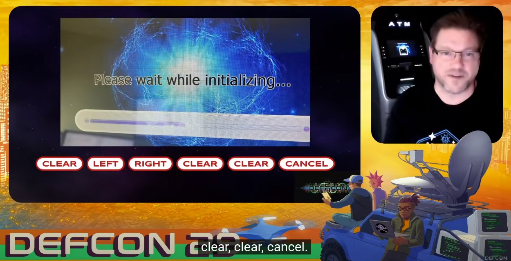

Terdapat beberapa hal yang dapat dilakukan untuk melakukan Black Box Pentest pada mesin ATM secara fisik, namun dengan catatan pengetesannya harus dilakukan secara etis dan sudah mendapatkan izin dari klien terkait (For Educational Purposes Only).


# Sandbox Escape

## 1. Bypass Kiosk with Swipe Screen
Hal pertama yang bisa kita coba untuk Kiosk Bypass yaitu dengan cara Swipe Screen, seperti geser layar (drag) dari pojok kiri ke kanan atau sebaliknya, hal ini dapat dilakukan dengan catatan kalau mesin tersebut sudah menggunakan Touchscreen.

## 2. Recon the shortcuts to enter Operator Mode
Operator Mode adalah sebuah tampilan yang berisikan menu-menu untuk melakukan konfigurasi terhadap ATM, mode ini di luar dari tampilan untuk pengguna pada umumnya, karena mode ini diperuntukkan hanya untuk teknisi saja.

Untuk membuka Operator Mode hanya saja perlu melakukan sedikit riset terlebih dahulu terkait mesin ATM yang digunakan.

Sebagai contoh, saya menggunakan Google Dork di bawah ini untuk mencari Manual Book untuk mesin ATM dari produsen Hyosung.

```
intext:"Hyosung" intext:"MX8100T" intext:"Operator Manual"
```

Panduan untuk memasuki Operator Mode itu ada beberapa cara, sebagai contoh yang pernah saya baca itu bisa menggunakan  `0000#8888#`, ada juga yang menggunakan `CLEAR` + `ENTER` + `CANCEL` secara bersamaan, dan masih banyak lagi variasinya.



# Input Through External Devices

## 1. Card Reader Testing

Terdapat macam-macam Card Reader, namun yang sering diimplementasikan pada mesin ATM yaitu:
1. Magnetic Stripe Card
2. Smart Card (Chip)

Untuk melakukan Test terkait hal ini mungkin agak sedikit _pricey_, dikarenakan ada beberapa skenario yang mengharuskan kita untuk memiliki _device_ guna membuat kartu-kartu fiktif yang akan digunakan untuk memasukkan _payload_. Namun bila memungkinkan, berikut ini adalah kumpulan _test-case_ yang dapat dilakukan.

**Card Reader Test-case**
- Masukkan kartu dengan tanggal kedaluwarsa yang sudah habis (_Expired_).
- Masukkan kartu yang dilaporkan hilang atau dicuri.
- Masukkan kartu yang bukan milik penerbit kartu mana pun (kartu dengan BIN yang tidak valid).
- Masukkan kartu dengan strip magnetik yang salah atau dengan chip yang rusak.

> This post is still continuing...