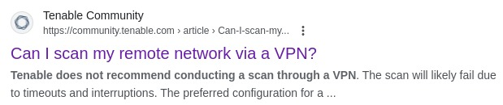
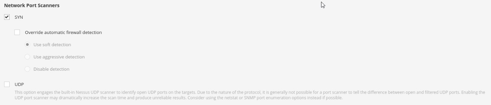
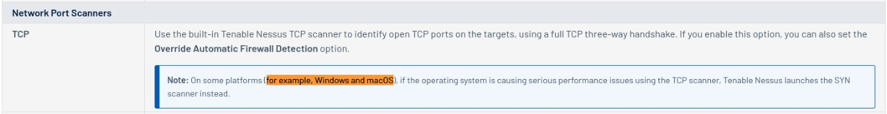
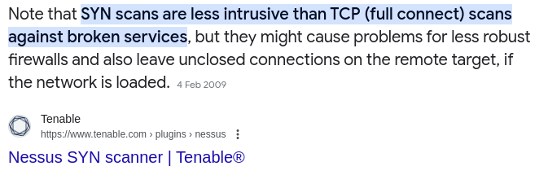
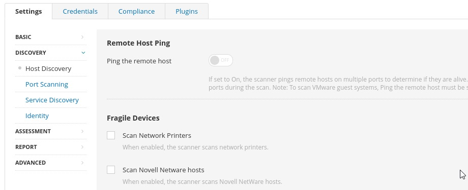
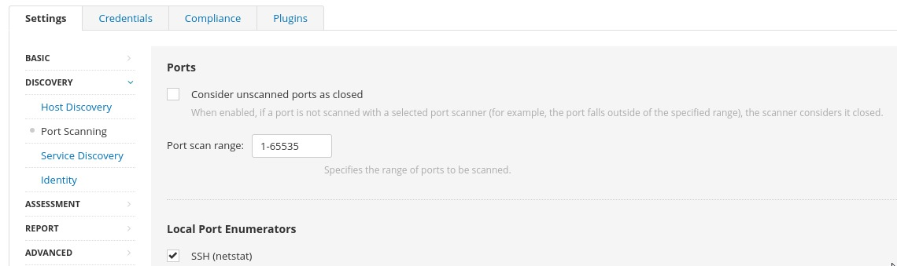
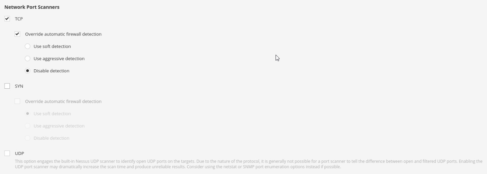

Pada beberapa hari lalu, saya membantu teman saya untuk melakukan Troubleshot pada Nessus. Karena sebelumnya saya punya pengalaman pahit saat Port Scanning menggunakan OS Windows maka saya memberanikan diri untuk membantu Troubleshot.

Assumption:
> Nessus cannot scan over VPN

Masalah yang ia hadapi pada awalnya yaitu "tidak bisa scan melalui VPN". Tentunya masalah ini adalah masalah umum yang dialami oleh banyak orang.

Sebetulnya saya sudah sedikit putus asa setelah mendengar pernyataan dari tim Tenable tersebut. Namun, apa salahnya mencoba untuk Troubleshot lebih dalam lagi?

Setelah mencoba beberapa konfigurasi pada Nessus, akhirnya saya menemukan suatu pencerahan yaitu Disable Firewall Detection. Namun, muncul masalah baru.

# Main Problem - Missing TCP Scan on Windows Platform

Saya tidak melihat adanya konfigurasi terhadap TCP di Nessus versi Windows.

Dari statement yang terdokumentasi di website resmi Tenable (Nessus), saya berasumsi bahwa Nessus (versi Windows dan MacOS) sudah tidak mengimplementasikan TCP Scan. Hal ini, kemungkinan karena Performance Issue.

Akhirnya, saya menyarankan teman saya untuk...
> Install Nessus di Linux

Saya tidak sedang bercanda, yang kita butuhkan itu TCP Scan, karena SYN Scan dan UDP Scan terkadang menyebabkan kerancuan pada hasil scan-nya. Dengan TCP Scan-lah kita bisa lebih akurat, karena mekanisme Full Connect-nya.

# Finally! It works with this configuration

1. Disable Ping Host

2. Custom Port Scanning

3. Use TCP Scan and Disable Firewall Detection

