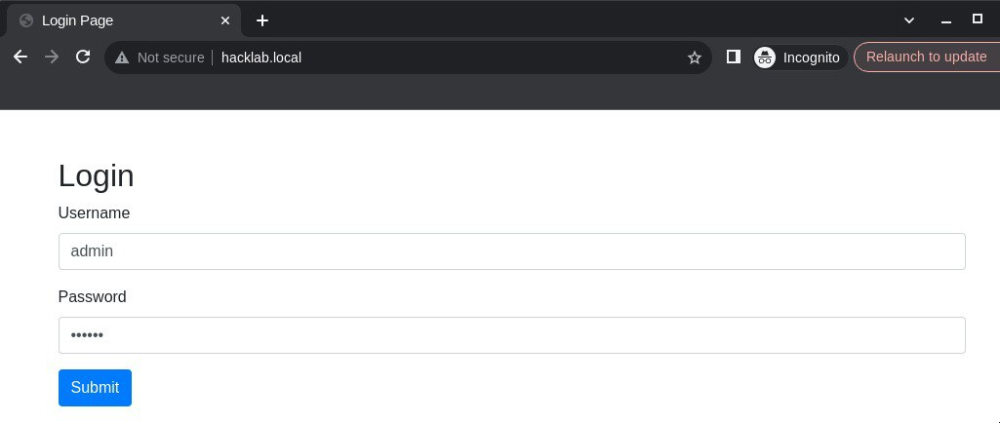
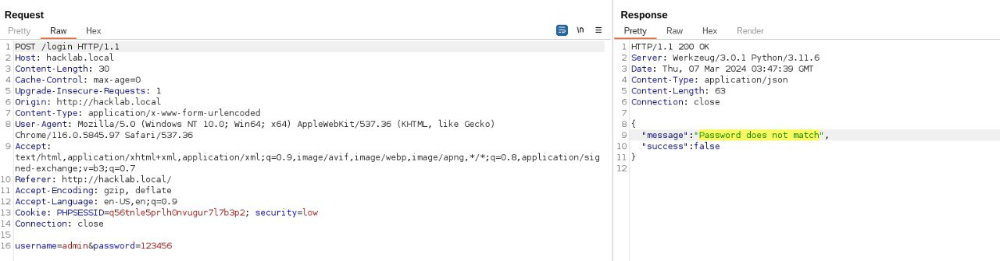
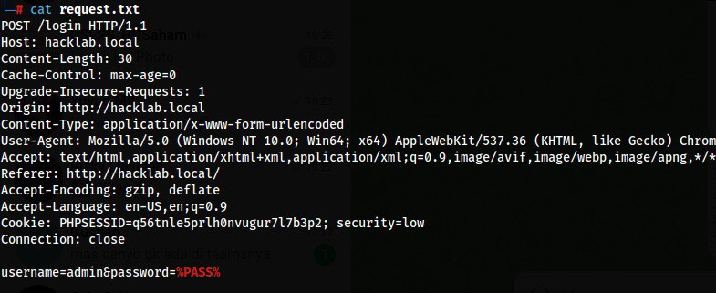
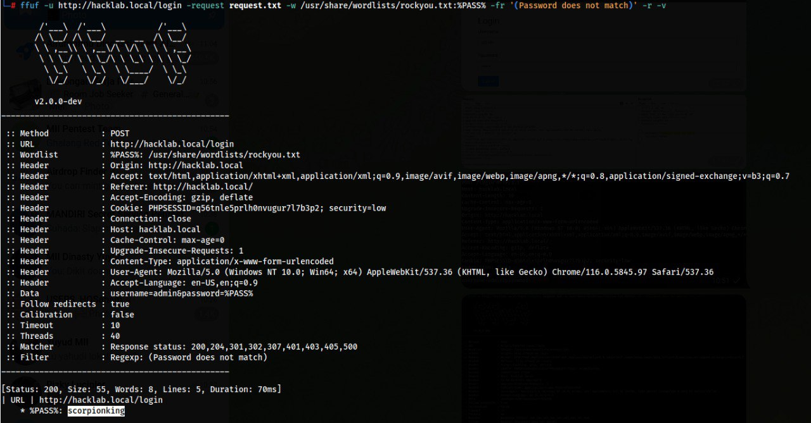

Waktu saya mengerjakan Exam dari salah satu sertifikasi Pentest, saya lupa bahwa laptop yang saya gunakan itu adalah _laptop kentang_. Letak kebodohan saya di sini, meskipun saya tahu bahwa laptop saya tidak kuat untuk membuka Wordlist berukuran raksasa melalui Intruder di BurpSuite, namun saya tetap memaksakannya. Pada akhirnya saya berganti Tool ke Hydra yang di mana fiturnya sangat terbatas sekali untuk melakukan Brute HTTP Login.

Akhirnya salah satu teman saya (Mas Yuyud) menyarankan untuk menggunakan FFuF. Di sinilah letak kebodohan saya yang kedua, yaitu sebelumnya saya sering menggunakan FFuF tanpa membaca dokumentasi lengkapnya, yang ternyata FFuF bisa difungsikan untuk Brute HTTP Login (Website).

<h1 class="header-group">Proof of Concept</h1>

Sebagai contoh, di sini saya sudah menyiapkan aplikasi sederhana untuk mendemokannya pada artikel ini.



Yang perlu kita lakukan selanjutnya yaitu menangkap Request Login (lengkap) dengan HTTP Header, Parameter dan Response Error-nya. Untuk menangkap hal-hal tersebut, di sini saya menggunakan BurpSuite.



Sebagai catatan, yang perlu kita ambil adalah:

1. HTTP Request (lengkap dengan Header dan Parameter)
2. Pesan Error saat gagal login (untuk di-filter melalui FFuF)

Karena target enumerasi kita adalah Parameter Password, maka kita ubah saja isi dari Password-nya menjadi `%PASS%`. Kemudian Request tersebut kita masukkan ke dalam file (misal: `request.txt`).



Jika sudah, kita langsung jalankan saja FFuF-nya dengan Command di bawah ini.

```
ffuf -u http://example.com/login -request request.txt -w /usr/share/wordlists/rockyou.txt:%PASS% -fr '(error message)' -r -v
```



Penjelasan singkat:

- `-u` URL target
- `-request` untuk memanggil Attribute lainnya pada Request yang akan kita kirim
- `-w` Parameter untuk memanggil Wordlist dan tiap Password-nya akan dipanggil melalui variabel `%PASS%` (yang dipanggil melalui **request.txt**)
- `-fr` Filter RegEx, digunakan untuk menyaring kata-kata yang bersifat Error
- `-r` Follow Redirect, jika kata Error-nya terdapat pada halaman selanjutnya, maka FFuF secara otomatis mengikuti halaman tersebut
- `-v` Verbose (optional)

