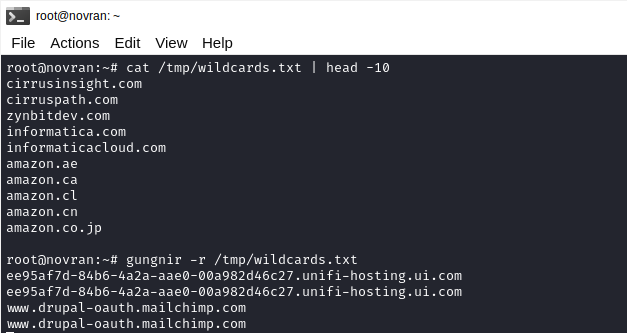

Mungkin kalian yang sering berburu Bug di internet, sudah sangat familiar dengan adanya sebuah Website [https://crt.sh](https://crt.sh). Namun, ada hal yang menarik yang sekiranya bisa saya ulas di blog ini.

Beberapa hari lalu, saya menonton sebuah video yang berjudul "In Recon: If You're Not First You're Last" di Youtube, video tersebut dibuat oleh salah satu panutan saya, jika kalian ingin menontonnya kalian dapat mengunjungi link berikut [https://www.youtube.com/watch?v=Azn0twesqdA](https://www.youtube.com/watch?v=Azn0twesqdA).

Ada salah satu topik menarik yang dibahas oleh seorang Bug Hunter. Dia bilang, saat melakukan Recon pada target Domain Wildcard, ia menemukan sebuah Subdomain yang belum terdata di platform OSINT manapun. Saat memonitor CT Logs dia menyadari, hasil Scan dari `subfinder` dan `crtsh` belum menampilkan data Subdomain yang ia temukan itu.

Certificate Transparency (CT) Logs adalah sistem untuk memantau penerbitan sertifikat SSL/TLS. Selain menajadi jurnal publik yang tidak dapat diubah, CT Logs tentunya berisi semua catatan sertifikat SSL/TLS yang diterbitkan oleh Certificate Authority (CA).

Banyak Browser yang secara otomatis sudah membaca CT Logs. Misalnya Google Chrome, ketika ingin mempercayai sebuah Website, maka Google Chrome memerlukan bukti bahwa sertifikat sudah tercatat di CT Logs.

Catatan lainnya:

- [https://certificate.transparency.dev](https://certificate.transparency.dev)
- [https://www.gstatic.com/ct/log_list/v3/all_logs_list.json](https://www.gstatic.com/ct/log_list/v3/all_logs_list.json)

# Gungnir

Gungnir adalah sebuah tool (command-line) yang dibuat menggunakan Go, fungsi utama tool ini yaitu untuk memantau CT Logs agar mendapatkan sertifikat SSL/TLS yang baru terbit.

### Installation

```
go install github.com/g0ldencybersec/gungnir/cmd/gungnir@latest
```

```
sudo mv ~/go/bin/gungnir /usr/local/bin/
```

### Usage



Filter menggunakan List (Root Domain):

```
gungnir -r rootdomain.txt
```

Filter Single-Target:

```
gungnir | grep "domain.com"$
```

Tanpa Filter:

```
gungnir
```

#### Note

Karena tool ini untuk memonitor, maka ketika dijalankan tentunya perlu diberhentikan, karena tool ini tidak akan pernah selesai.
