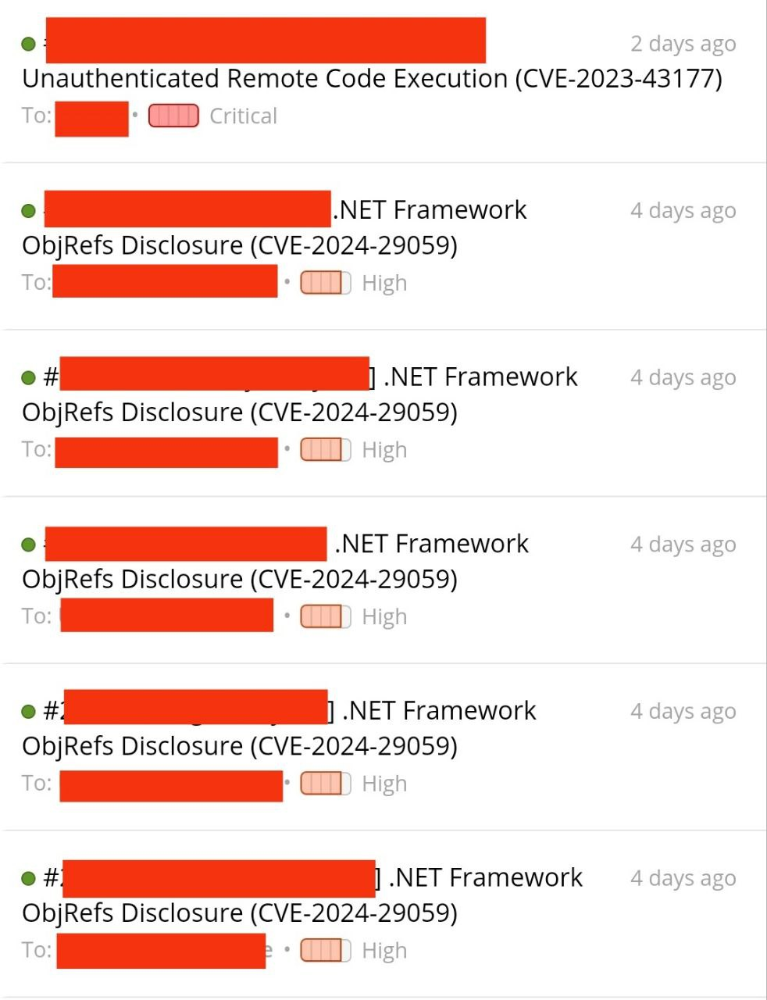
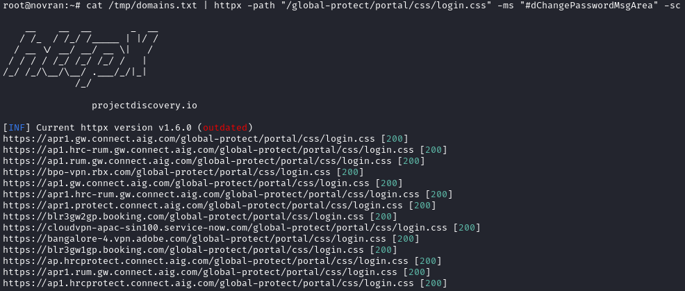

Ok! Agar tidak bertele-tele, saya ingin cerita sedikit. Bulan kemarin saya kebanjiran Triaged Report di Hackerone (meskipun hanya VDP). Padahal saya sepenuhnya hanya bergantung pada Automatic Scan (karena saya malas).



## How?

Pada awalnya saya hanya bergantung pada Nuclei dengan Template Technologies-nya.

Stop using this on wildcard targets:
```
nuclei -t http/technologies
```

Namun, saya merasa itu sangat Overkill dan tidak efektif. Lalu saya teringat dengan salah satu Project saya [Pathprober](https://github.com/xchopath/pathprober) yang sudah saya tinggalkan sejak lama. Setelah itu, saya mencari-cari Tool serupa dan saya menemukan HTTPX-lah solusinya.

Di dalam Bug Hunting yang kita butuhkan itu bukan hanya "cepat" tapi juga harus "tepat". Karena pengecekan HTTP Code 200 sudah hampir tidak relevan saat ini. Maka, lebih baik menggunakan validasi string, seperti:


```
httpx -path "/commonpath" -ms "common string"
```



## Installation

Untuk instalasinya, kalian bisa langsung menuju Repository [https://github.com/projectdiscovery/httpx/releases/latest](https://github.com/projectdiscovery/httpx/releases/latest).

Atau, jika kalian itu malas (seperti saya), di sini saya sudah siapkan sebuah command, agar HTTPX-nya bisa langsung siap pakai.

Quick Installation for Linux (amd64):
```
curl -s "https://api.github.com/repos/projectdiscovery/httpx/releases/latest" | grep "httpx_.*_linux_amd64.zip" | cut -d : -f 2,3 | tr -d \" | wget -qi -
unzip -o $(ls | grep httpx_ | grep zip$)
chmod +x httpx
mv httpx /usr/local/bin/
rm $(ls | grep httpx_ | grep zip$)
```

# Cheatsheet

.NET Application:
```
httpx -silent -path "/RemoteApplicationMetadata.rem" -ms "To get more info turn on customErrors in the server"
```

CrushFTP:
```
httpx -silent -path "/WebInterface/Resources/js/login.js" -ms "CrushFTP"
```

Ivanti CS:
```
httpx -silent -path "/dana-na/css/signin.css" -ms "dana-na/imgs"
```

GlobalProtect VPN / PAN-OS:
```
httpx -silent -path "/global-protect/portal/css/login.css" -ms "#dChangePasswordMsgArea"
```

PHP Info:
```
httpx -silent -path "/phpinfo.php" -ms "PHP Version"
```

To be continued...
